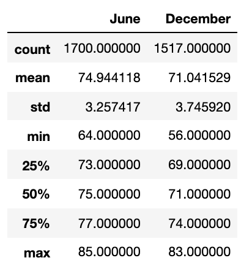

# Surfs_Up

## Overview of the statistical analysis
### Purpose
This analysis is done for W. Avy to provide him with more information about the temperature trends before opening the surf shop.

## Results
Three key differences in weather between June and December are: 

- The average recorded temperature for the month of June is 74.94 degrees F, where as, The average recorded temperature for the month of December is 71.04 degrees F

- The max temp recorded is 85 degrees F in June and 83 degrees F in Dec

- The min temp recorded is 64 degrees F in June and 56 degrees F in Dec

## Summary
The weather in June compared to the weather in December seems to vary, however, both months in my opinion, would have a good weather conditions for surfing. 

### Additional Queries to gather more weather data for June and December

It would nice to gather more data to get further information. For example, 

- If we can query the temperature based on the station location, we would know which station will be a petter location for the shop

- We could also create a query to get precipitation information to determine whether it plays a factor despite the warm temperatures that are experienced during this time.
